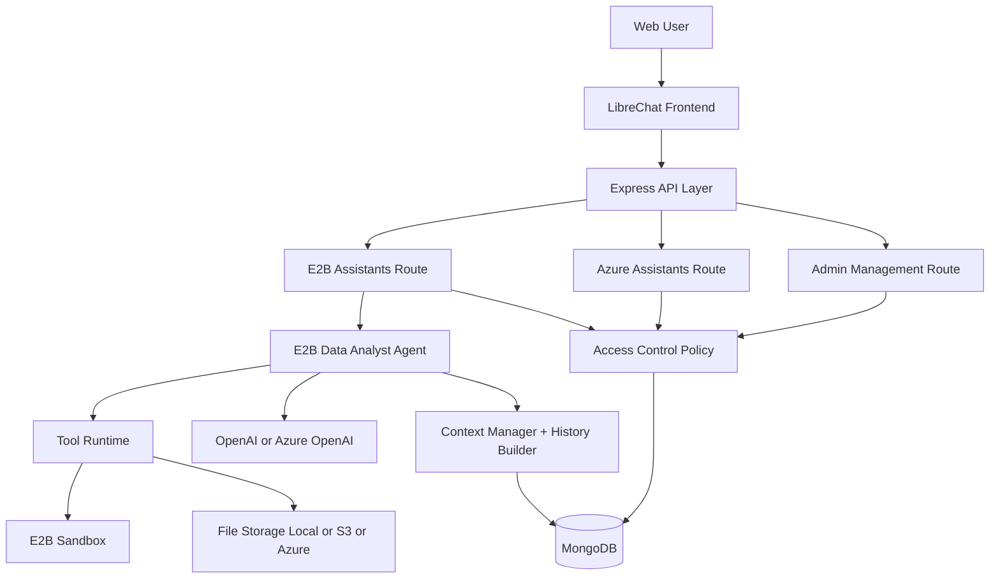
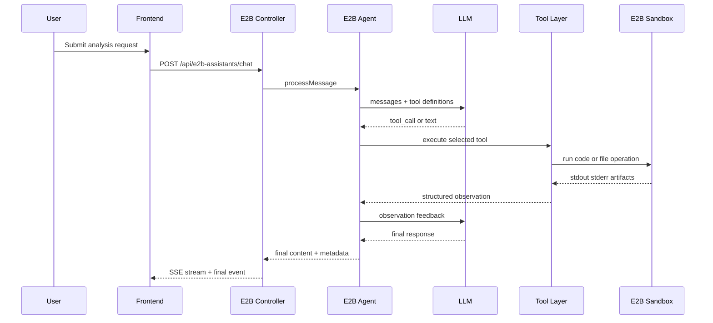
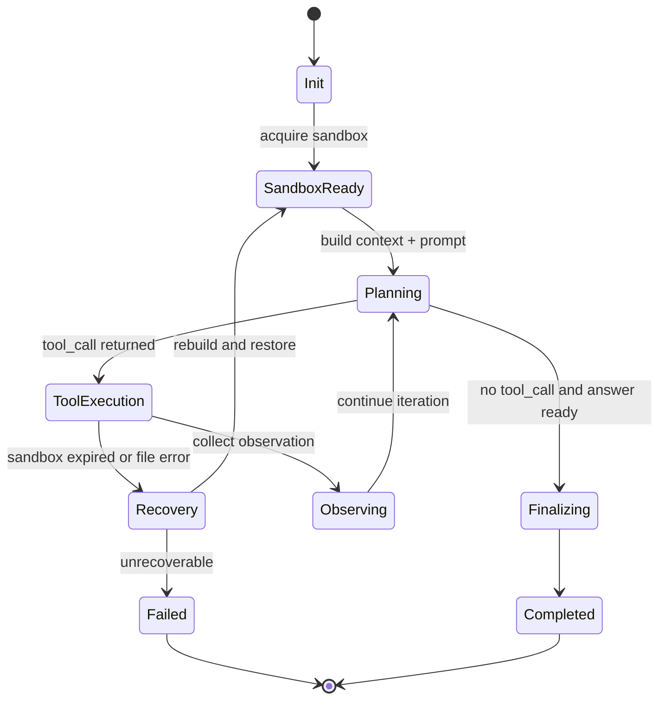

# LibreChat 项目扩展功能开发文档

## 架构级总结

版本: v2.0  
日期: 2026-03-28  
审计口径: upstream/main .. origin/main

---

## 1. 文档概述

本文档从架构与工程方法视角，系统说明 LibreChat 在 Fork 后完成的两项核心扩展：

1. E2B Data Analyst Agent
2. Azure Assistants 管理员权限控制优化

文档目标不是追踪每次代码改动，而是明确最终系统形态、能力边界、关键技术机制和可持续演进方向，服务教学场景下的课程设计、课堂实践与学生使用。

---

## 2. 项目背景与开发动因

### 2.1 原有问题

在原始 LibreChat 能力基础上，项目面临两类结构性问题：

1. 复杂数据分析场景缺乏稳定执行引擎
- Azure Assistants 在长链路数据任务、复杂 Python 计算、产物导出和多轮恢复场景下，存在可控性和稳定性不足。

2. 助手权限治理不足
- 助手可见性要么过宽（任意用户创建助手被全员访问），要么过严（普通用户无法有效创建和使用助手），无法兼顾隔离与协作。

### 2.2 开发目标

1. 构建独立的数据分析 Agent 执行通道，补齐复杂分析任务能力。  
2. 构建可落地的助手权限模型，实现“私有隔离 + 管理员可控共享”。  
3. 在能力增强同时，控制上下文成本、提升长会话稳定性和运营可观测性。

---

## 3. 审计结论与变更全景

基于 upstream/main 与 origin/main 的代码审计，本轮扩展具备以下特征：

1. 提交规模
- 89 次提交
- 139 个变更文件
- 17842 行新增，204 行删除

2. 变更重心
- 后端主重心: E2B 路由层、Agent 主循环、工具系统、沙箱管理、权限控制控制器
- 前端主重心: 管理员控制台、助手选择与可见性过滤、消息渲染稳定性与上下文信息可视化
- 数据模型主重心: 用户分组、助手可见性分组、E2B Assistant 配置模型

3. 工程特征
- 明显采用“能力闭环 + 治理闭环”并行推进
- 以 E2B 执行能力为纵轴，以权限和可见性治理为横轴

---

## 4. 总体架构: 双核心扩展模型

### 4.1 能力层与治理层分离

本次扩展形成两个可独立演进但可协同运行的系统层：

1. 能力层: E2B Data Analyst Agent
- 负责数据任务理解、工具调用、代码执行、产物生成、结果汇总

2. 治理层: Azure Assistants 权限控制
- 负责助手所有权、可见范围、管理员分组分发、跨用户协作边界

### 4.2 两者关系

1. 关联性
- E2B Agent 可作为管理员共享助手的执行后端，服务课程和项目协作。

2. 独立性
- E2B 能力可独立运行，不依赖 Azure Assistants 权限模块。
- 权限治理可独立作用于 Azure Assistants，不依赖 E2B 工具链。

### 4.3 架构图（逻辑视图）



### 4.4 运行时交互图（执行主链）



### 4.5 项目目录与职责映射（采用 E2B 开发文档目录风格）

```text
LibreChat/
├── api/
│   ├── models/
│   │   └── E2BAssistant.js                  # [已实现] E2B Assistant 读写入口
│   ├── server/
│   │   ├── routes/
│   │   │   ├── e2bAssistants/
│   │   │   │   ├── index.js                 # [已实现] E2B 路由注册
│   │   │   │   └── controller.js            # [已实现] E2B HTTP/SSE 控制器
│   │   │   ├── files/
│   │   │   │   └── files.js                 # [已实现] 统一文件上传/下载/删除入口
│   │   │   └── admin.js                      # [已实现] 管理员治理路由
│   │   ├── services/
│   │   │   ├── Agents/
│   │   │   │   └── e2bAgent/
│   │   │   │       ├── index.js             # [已实现] ReAct 主循环
│   │   │   │       ├── contextManager.js    # [已实现] 会话状态与动态上下文
│   │   │   │       ├── historyBuilder.js    # [已实现] 历史压缩/窗口策略
│   │   │   │       ├── tools.js             # [已实现] 工具协议与执行封装
│   │   │   │       └── prompts.js           # [已实现] Prompt 协议层
│   │   │   ├── Endpoints/
│   │   │   │   └── e2bAssistants/
│   │   │   │       ├── index.js             # [已实现] 端点入口
│   │   │   │       ├── initialize.js        # [已实现] 沙箱生命周期管理
│   │   │   │       └── buildOptions.js      # [已实现] 端点选项构建
│   │   │   ├── Sandbox/
│   │   │   │   ├── codeExecutor.js          # [已实现] 沙箱代码执行
│   │   │   │   └── fileHandler.js           # [已实现] 沙箱文件同步/产物持久化
│   │   │   └── Files/
│   │   │       └── process.js               # [已实现] 文件处理策略编排
│   └── tests/
│       └── e2b/
│           ├── codeExecutor.test.js         # [已实现] 执行器测试
│           ├── fileHandler.test.js          # [已实现] 文件处理测试
│           └── real_integration.js          # [已实现] E2B 集成测试
├── client/
│   └── src/
│       ├── components/Admin/                # [已实现] 管理端用户与会话界面
│       ├── components/SidePanel/Builder/    # [已实现] 助手构建与文件配置
│       └── hooks/SSE/                       # [已实现] 消息流事件处理
├── packages/
│   ├── data-schemas/
│   │   └── src/schema/
│   │       ├── e2bAssistant.ts              # [已实现] E2B 助手 Schema
│   │       ├── user.ts                      # [已实现] groups 字段
│   │       └── assistant.ts                 # [已实现] group 可见性字段
│   └── data-provider/
│       └── src/
│           ├── api-endpoints.ts             # [已实现] admin API 与文件 API 映射
│           └── data-service.ts              # [已实现] 前端数据访问封装
└── docs/
	├── LIBRECHAT_PROJECT_EXTENSION_DEVELOPMENT.md
	├── E2B_DATA_ANALYST_AGENT_DEVELOPMENT.md
	└── help_docs/文件流逻辑.md
```

该目录映射体现了三个边界：

1. 执行边界: e2bAgent + Sandbox 负责推理与执行闭环。  
2. 治理边界: admin + assistants 控制器负责可见性和权限。  
3. 交付边界: Files 服务负责上传、持久化、下载与删除一致性。  

---

## 5. 功能一: E2B Data Analyst Agent

## 5.1 Agent 范式: ReAct 工程化落地

该 Agent 采用 ReAct 思路的工程实现，不是单轮问答模型，而是“计划-执行-观察-修正-总结”的循环体：

1. Reason
- 基于系统提示与动态上下文拆解任务步骤，确定下一步动作。

2. Act
- 调用工具执行代码、访问文件、导出产物。

3. Observe
- 读取 stdout/stderr/traceback/产物路径并转化为下一步决策输入。

4. Iterate
- 在错误或信息不足时进行修复重试，而不是提前终止。

5. Complete
- 通过 complete_task 明确任务完成信号与最终摘要。

这一范式将 Agent 从“文本生成器”升级为“可迭代执行系统”。

## 5.2 工具系统: 面向数据分析的最小完备集

最终工具集合如下：

1. execute_code
- 在 E2B 沙箱中执行 Python 代码，返回结构化执行结果与可视化产物信息。

2. list_files
- 列出沙箱目录文件，用于路径诊断和文件发现。

3. upload_file
- 将文件写入沙箱执行环境，支撑后续分析调用。

4. export_file
- 将沙箱产物导出为 LibreChat 可下载资源链接，闭环交付用户。

5. complete_task
- 作为任务结束协议，保证最终输出具有完成态语义。

这组工具覆盖了数据任务的完整链路: 输入、执行、诊断、产出、交付。

## 5.3 上下文工程: 分层注入与预算治理

E2B Agent 的上下文并非简单拼接，而是分层工程：

1. 静态层
- 系统 Prompt 定义角色、规则、输出规范和工具使用约束。

2. 动态层
- ContextManager 注入当前会话文件状态、已生成产物、错误恢复线索。

3. 历史层
- HistoryBuilder 在多轮场景中做窗口保留与摘要压缩，降低上下文膨胀。

4. 观测层
- 工具执行结果作为 observation 回灌，驱动下一步动作。

5. 预算层
- 通过 token 指标与压缩判定策略控制长会话成本。

核心价值是把“上下文”从被动日志变成可治理资源。

## 5.4 记忆机制: 有限记忆而非长期知识库

当前实现具备两类记忆能力：

1. 会话内运行时记忆
- ContextManager 维护当前会话文件、产物、恢复信息。

2. 跨轮摘要记忆
- 通过历史摘要把旧轮次压缩为结构化信息，保留目标、结论、状态、待办。

当前尚未引入独立的长期检索记忆模块（如向量库型 memory）。

结论: 已具备“短期执行记忆 + 跨轮压缩记忆”，但不是完整的长期知识记忆系统。

## 5.5 异常处理与恢复机制

E2B Agent 的稳定性来自分层容错，而不是单点 try/catch：

1. 沙箱生命周期恢复
- 检测沙箱失活后自动重建，并尝试恢复会话文件状态。

2. 文件恢复策略
- 汇总消息附件、助手持久化文件、历史可恢复文件，进行去重回灌。

3. 错误语义化
- 对执行错误保留 error type 与 traceback 关键片段，供模型做修复决策。

4. 路径类错误自愈
- FileNotFound 类错误可触发目录校验与路径纠正流程。

5. 平台级鲁棒性
- 对速率限制、临时失败、流式不一致等场景进行重试与降级处理。

结果是 Agent 从“失败即中断”升级为“可恢复执行”。

## 5.6 Prompt 编排策略

Prompt 不是单段指令，而是带约束协议的编排体系：

1. 角色定义
- 明确为专业数据分析 Agent，职责覆盖 EDA、建模、可视化、报告。

2. 工具规约
- 每个工具有明确用途、输入参数与调用时机。

3. 行为约束
- 先计划再执行、步骤顺序、错误后修复、语言一致性、结果结构化输出。

4. 产物规则
- 图像显示与文件导出的处理规则分离，避免展示与下载混淆。

5. 完成协议
- 强制 complete_task 收尾，减少未完成态输出。

本质上是将模型行为从“自由文本”转为“受控任务执行协议”。

## 5.7 最终能力效果

1. 能承接复杂数据分析任务，且具备工具化执行与结果交付闭环。  
2. 长会话场景下，具备上下文压缩和指标观测能力。  
3. 对沙箱过期、文件丢失、执行异常具备可恢复能力。  
4. 可用于课程作业、研究分析、团队协作等生产化场景。

## 5.8 Agent 状态机（运行时）



## 5.9 Prompt 编排分层

1. Policy Layer（政策层）
- 角色定义、行为边界、语言一致性、合规约束。

2. Procedure Layer（过程层）
- Plan -> Execute -> Observe -> Complete 的步骤协议。

3. Tool Contract Layer（工具契约层）
- 各工具输入输出契约、何时调用、失败时如何回退。

4. Output Layer（输出层）
- 对用户呈现的结构化结果格式和下载交付格式。

5. Recovery Layer（恢复层）
- 针对 FileNotFound、Sandbox Expired、Rate Limit 的恢复策略提示。

## 5.10 文件处理与生命周期

本节基于代码路径校验，覆盖文件从上传、关联、同步、导出到删除的完整生命周期。

### 5.10.1 两种上传模式

| 维度 | 助手配置上传 | 对话附件上传 |
|---|---|---|
| 触发入口 | Assistant Builder | Chat 输入区附件 |
| 关键标记 | assistant_id 存在且 message_file=false 或空 | message_file=true |
| 关联目标 | assistant.tool_resources + assistant.file_ids | 消息级 file_ids |
| 生命周期 | 持久化，跨会话可重用 | 临时会话附件 |
| 主要用途 | 课程/项目共享数据集 | 单次任务临时输入 |

### 5.10.2 上传处理主链

1. 统一入口由 files 路由接收并规范 metadata。  
2. processFileUpload 根据 endpoint 选择存储策略。  
3. E2B 场景优先使用平台文件策略，不走 OpenAI 向量存储路径。  
4. 对 E2B 助手的持久化上传，会同时更新 tool_resources 与 file_ids。  
5. 文件记录写入 files 集合，供后续沙箱同步和下载鉴权复用。  

### 5.10.3 同步到沙箱的真实策略

E2B Agent 在执行前合并以下来源并去重后同步：

1. 当前消息附件文件。  
2. assistant.tool_resources.code_interpreter.file_ids。  
3. assistant.file_ids（兼容保底）。  

同步实现按 file_id 查询文件元数据并拉取流，再写入沙箱路径 /home/user/filename。

### 5.10.4 产物持久化与下载

1. execute_code 产出的图像/文件由 fileHandler.persistArtifacts 落盘或对象存储。  
2. export_file 用于显式导出非图片结果并返回下载链接。  
3. 下载统一走 /files/{userId}/{file_id}/{filename} 或等效下载接口，保证鉴权一致。  

### 5.10.5 删除与解关联

删除流程支持三类行为：

1. 仅删除物理文件与文件记录。  
2. 删除并同步解关联 E2B Assistant 的 tool_resources/file_ids。  
3. 在 agent/assistant 资源上下文下执行批量解关联。  

该流程保证“文件实体”与“助手引用关系”一致回收，避免悬挂 file_id。

### 5.10.6 与参考文档的一致性说明

对 help_docs 中文件流逻辑的核验结论如下：

1. 双上传模式（持久化 vs 消息附件）的核心判断逻辑是正确的。  
2. E2B 同步来源三合一并去重的描述与当前实现一致。  
3. 需以当前代码为准的点：
- 实际字段在不同入口存在 e2b_assistant_id 到 assistant_id 的归一化。
- 下载路由和上下文字段会随 endpoint 与策略动态确定，不建议硬编码单一路径描述。

---

## 6. 功能二: Azure Assistants 管理员权限控制优化

## 6.1 权限模型重构目标

目标不是“限制创建”，而是构建三层可控模型：

1. 所有权层
- 助手与创建者绑定，普通用户默认私有。

2. 管理层
- 管理员可管理用户、分组、可见性配置。

3. 协作层
- 管理员创建助手可设为全员可用或分组可用。

## 6.2 最终访问语义

1. 普通用户
- 可见并可操作自己创建的助手。
- 可见管理员发布的公共助手。
- 可见与自己 groups 交集命中的分组助手。

2. 管理员
- 全局可见并具备管理能力。

这一语义同时解决了越权访问和协作阻塞问题。

## 6.3 数据模型与接口形态

1. 用户模型
- 引入 groups 字段支持多分组归属。

2. 助手模型
- 引入 group 字段定义可见性分组。

3. 管理员 API
- 提供用户管理、分组管理、会话审计接口。

4. 前端控制台
- 提供 User Management 与 Admin Conversations 入口，形成运营闭环。

## 6.4 与 E2B 的协同价值

1. 管理员可发布面向课程或项目的共享分析助手。  
2. 用户在同一共享助手下复用同一套数据文件与能力配置。  
3. 减少重复上传，降低存储冗余与运维压力。

## 6.5 权限决策矩阵

| 场景 | 普通用户 | 管理员 | 预期结果 |
|---|---|---|---|
| 访问自己创建助手 | 是 | 是 | 允许 |
| 访问他人普通私有助手 | 否 | 是 | 普通用户拒绝，管理员允许 |
| 访问管理员创建且无 group 助手 | 是 | 是 | 全员允许 |
| 访问管理员创建且有 group 助手（命中） | 是 | 是 | 允许 |
| 访问管理员创建且有 group 助手（未命中） | 否 | 是 | 普通用户拒绝，管理员允许 |
| 修改/删除非本人助手 | 否 | 是 | 普通用户拒绝，管理员允许 |

说明: 该矩阵可直接映射为自动化集成测试用例。

## 6.6 配置矩阵（运行与治理）

### 6.6.1 LLM 与 Endpoint 配置矩阵

| 配置项 | 作用域 | 说明 | 建议值 |
|---|---|---|---|
| OPENAI_API_KEY | 后端 | 标准 OpenAI 鉴权 | 生产环境密钥 |
| AZURE_OPENAI_ENDPOINT | 后端 | Azure OpenAI 基地址 | 资源端点 |
| AZURE_OPENAI_API_KEY | 后端 | Azure OpenAI 鉴权 | 生产环境密钥 |
| AZURE_OPENAI_API_VERSION | 后端 | Azure 版本能力开关 | 与部署模型匹配 |
| AZURE_OPENAI_DEPLOYMENT | 后端 | Azure 部署名 | 与模型策略一致 |
| endpoints.e2bAssistants | 应用配置 | 启用 E2B 端点 | true |
| endpoints.azureAssistants | 应用配置 | 启用 Azure 助手端点 | true |

### 6.6.2 E2B 沙箱与执行配置矩阵

| 配置项 | 作用域 | 说明 | 建议 |
|---|---|---|---|
| E2B_API_KEY | 后端 | E2B 平台鉴权 | 必填 |
| E2B_SANDBOX_TEMPLATE | 后端 | 沙箱模板 ID/名称 | 统一模板版本 |
| E2B_DEFAULT_TIMEOUT_MS | 后端 | 默认会话超时 | 按任务长度设定 |
| assistant.e2b_config.timeout_ms | 助手级 | 单助手覆盖超时 | 数据任务推荐较高上限 |
| assistant.allowed_libraries | 助手级 | 可用 Python 库白名单 | 与模板保持一致 |

### 6.6.3 上下文治理配置矩阵

| 配置项 | 作用域 | 说明 | 建议 |
|---|---|---|---|
| contextManagement.messageWindowSize | e2b endpoint | 历史窗口长度 | 24 左右起步 |
| contextManagement.summaryRefreshTurns | e2b endpoint | 摘要触发节奏 | 按任务轮次压测 |
| contextManagement.estimatedSystemTokens | e2b endpoint | 预算估计项 | 按 prompt 实测校准 |
| contextManagement.compactionSummaryMaxTokens | e2b endpoint | 摘要 token 上限 | 800-1500 区间压测 |
| reserveOutputTokens | agent runtime | 预留输出预算 | 避免响应截断 |
| toolObservationMaxChars | agent runtime | observation 回灌上限 | 与正确率平衡 |

### 6.6.4 权限治理配置矩阵

| 配置项 | 作用域 | 说明 | 建议 |
|---|---|---|---|
| privateAssistants | assistants endpoint | 是否默认私有校验 | 除特定场景外保持启用 |
| user.groups | 用户模型 | 用户分组归属 | 支持多组 |
| assistant.group | 助手模型 | 助手可见性分组 | 管理员按课程/项目分配 |
| metadata.author/role/group | 助手元数据 | 跨端点可见性补充字段 | 创建/更新时强制写入 |

## 6.7 自定义模板与预装包

### 6.7.1 当前模板体系

当前 E2B 数据分析环境采用 TypeScript 模板方式维护，模板定义位于 e2b_template/data-analyst/template.ts。

模板基线为 code-interpreter-v1，并在构建阶段注入：

1. 系统依赖
- PDF/表格/OCR/图像处理相关系统包（如 poppler、ghostscript、tesseract、opencv 运行依赖）。

2. 数据分析与机器学习依赖
- pandas、numpy、scipy、statsmodels、scikit-learn、xgboost、lightgbm、catboost 等。

3. 高级能力依赖
- 高性能数据处理（polars、dask、modin）。
- 文档与 OCR（pymupdf4llm、camelot、easyocr、pytesseract、markitdown）。
- NLP 与向量化（transformers、sentence-transformers）。

该设计使教学任务在“开箱即用”的前提下覆盖课程中常见的数据处理、建模、报告和文档解析场景。

### 6.7.2 构建与发布流程

模板构建脚本位于 e2b_template/data-analyst/package.json，当前包含两套构建命令：

1. 开发模板
- npm run e2b:build:dev
- 对应 build.dev.ts，构建别名为 data-analyst-dev，并显式配置较高资源规格用于教学调试。

2. 生产模板
- npm run e2b:build:prod
- 对应 build.prod.ts，构建别名为 data-analyst，用于稳定运行环境。

模板发布后可获得可用模板标识，建议在教学环境中固定版本并在学期内保持一致，避免课程中因镜像差异导致结果不一致。

### 6.7.3 运行时模板选取优先级

根据当前运行时代码，模板选取优先级为：

1. 助手级配置 assistant.e2b_sandbox_template（最高优先级）。
2. 环境变量 E2B_SANDBOX_TEMPLATE。
3. 系统默认模板 code-interpreter（兜底）。

---

## 7. 改造成效与技术价值

本次扩展的成效来自执行能力建设与治理能力建设的协同落地，具体体现在以下三个层面：

1. 能力完整性
- E2B Data Analyst Agent 建立了从任务理解、工具执行、结果观测到产物交付的闭环执行体系，显著提升复杂数据分析场景的可完成性。

2. 治理可控性
- Azure Assistants 的所有权与分组可见性模型补齐了多用户隔离和受控共享能力，降低越权风险并提升组织协作效率。

3. 工程可运营性
- 文件生命周期、上下文治理、配置矩阵和权限矩阵形成统一工程规范，使系统具备可观测、可测试、可演进的长期维护基础。

---

## 8. 后续优化建议（架构级）

## 8.1 Agent 方向

1. 引入长期记忆模块
- 在现有短期记忆基础上，增加可检索的长期任务记忆层。

2. 工具观测压缩
- 对超长 observation 做结构化压缩，进一步降低上下文成本。

3. 可插拔策略
- 将恢复策略、重试策略、压缩策略参数化为可配置策略集。

## 8.2 权限治理方向

1. 统一 ACL 策略服务
- 将控制器分散的权限判断收敛为单一策略层，降低维护复杂度。

2. 权限审计日志
- 记录助手授权变更和访问轨迹，满足教学与企业合规要求。

3. 组生命周期管理
- 补齐分组生命周期与跨环境迁移能力。

## 8.3 运营方向

1. 建立长会话评测基线
- 固化成功率、正确率、延迟和 token 成本的长期监控。

2. 灰度策略
- 新策略通过开关和 A/B 渐进发布，保障稳定迭代。

---

## 9. 结论

本轮扩展最终形成了 LibreChat 的两项关键能力：

1. E2B Data Analyst Agent: 可迭代执行、可恢复、可交付的分析执行系统。  
2. Azure Assistants 权限治理: 可隔离、可共享、可管理的多用户协作系统。

这两项能力共同把项目从“通用对话平台”推进到“可生产化的数据分析协作平台”。
